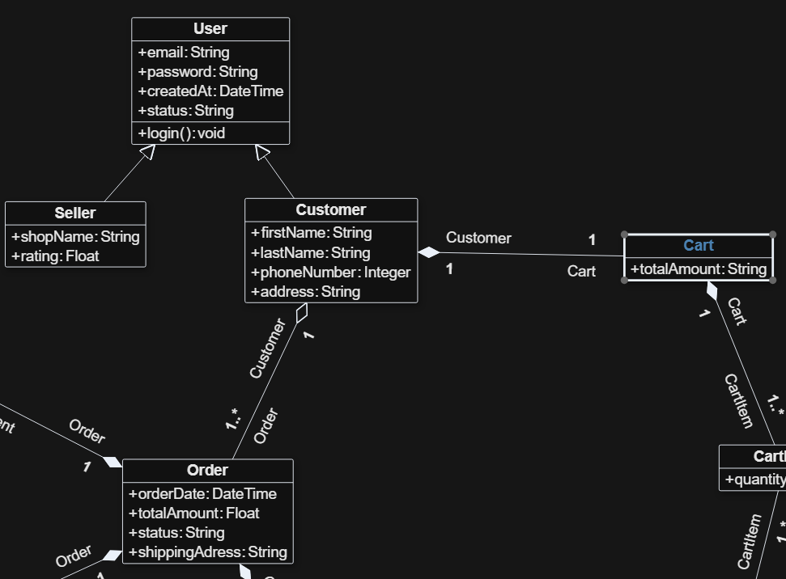
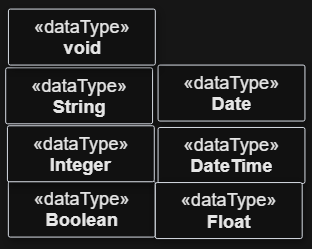

# MoTxT User Manual

## What MoTxT Does

MoTxT generates code from UML class diagrams. Currently supported frameworks include:

- Django
- FastAPI
- FastAPI with React

## Requirements

- Java installed and available on PATH.
- [bigUML extension](https://marketplace.visualstudio.com/items?itemName=BIGModelingTools.umldiagram) for creating diagrams inside VS Code.

## Class Diagram Guidelines

- Use class diagrams to define your models.
- Supported UML elements: classes, attributes, operations, generalization, aggregation, composition, association edge, property.

- Supported data types: Integer, String, Boolean, Float, Double, Date, DateTime, void. Other datatypes will be treated as String. You will need to manually create the datatypes in the Class Diagram and use them as the type of attributes or operation return types.

- Not supported: abstract classes, interfaces, enumerations, packages, and other UML elements.

---

## Drawing a Class Diagram with bigUML

bigUML is a VS Code extension for creating UML diagrams. It provides a graphical canvas, a **Tool Palette** for adding elements, and a **Property Palette** (VS Code panel) for editing element details. Source: [bigUML on GitHub](https://github.com/borkdominik/bigUML).

### Opening the Diagram Editor

1. Create a new file with the `.uml` extension, or open an existing one.
2. VS Code will open it automatically in the bigUML graphical editor.
3. If it opens as plain text, right-click the file and choose **Open With → bigUML Diagram Editor**.

---

### Creating a Class

1. In the **Tool Palette** on the left side of the diagram editor, find the **Class** element under the _Classifier_ group.
2. Click **Class** in the palette, then click anywhere on the canvas to place it.
3. A new class node appears with a default name. Double-click the name label to rename it (e.g., `Product`, `User`).

---

### Adding Properties (Attributes)

Properties represent the fields or data members of a class.

1. Select a class on the canvas by clicking it.
2. In the **Tool Palette**, click **Property** (under the _Class_ group), then click inside the class node to add it — or right-click the class and choose **Add → Property** from the context menu.
3. Double-click the new property label to edit its name (e.g., `name`, `price`).
4. With the property selected, open the **Property Palette** panel in VS Code (it appears automatically on the right or bottom when an element is selected).
5. In the Property Palette, set the **Type** field to a supported data type (see [Data Types](#data-types) below).

Each property will be generated as a model field in the target framework.

---

### Adding Operations (Methods)

Operations represent the behaviors or functions of a class.

1. Select a class on the canvas.
2. In the **Tool Palette**, click **Operation** (under the _Class_ group), then click inside the class node — or right-click the class and choose **Add → Operation**.
3. Double-click the operation label to rename it (e.g., `calculateTotal`, `getUser`).
4. With the operation selected, open the **Property Palette** and set the **Return Type** field (see [Data Types](#data-types) below). Use `void` if the operation returns nothing.

---

### Adding Parameters to Operations

Parameters define the inputs an operation accepts.

1. Select an operation on the diagram.
2. In the **Property Palette**, find the **Parameters** section and click the **+** (Add) button.
3. A new parameter entry appears. Set its **Name** (e.g., `quantity`, `userId`).
4. Set the parameter's **Type** to a supported data type (see [Data Types](#data-types) below).

Repeat for each parameter the operation needs.

---

### Setting Return Types on Operations

1. Select the operation on the diagram.
2. In the **Property Palette**, find the **Return Type** (or **Type**) field.
3. Type or select the desired return type (e.g., `String`, `Integer`, `void`).

Use `void` when the operation does not return a value.

---

### Data Types

The following data types are supported and will be mapped to the appropriate types in the generated code:

| UML Type   | Description                        |
|------------|------------------------------------|
| `Integer`  | Whole numbers                      |
| `String`   | Text values                        |
| `Boolean`  | True/false values                  |
| `Float`    | Single-precision decimal numbers   |
| `Double`   | Double-precision decimal numbers   |
| `Date`     | Date only (year, month, day)       |
| `DateTime` | Date and time combined             |
| `void`     | No return value (operations only)  |

Any type not in this list will be treated as `String` in the generated code.


#### Applying Data Types to Properties

1. Select a property inside a class on the canvas.
2. In the **Property Palette**, set the **Type** field to one of the supported types above (e.g., `Integer` for a numeric ID, `String` for a name field).

#### Applying Data Types to Operation Parameters

1. Select a parameter entry inside the **Property Palette** of an operation.
2. Set its **Type** field to the appropriate supported type.

#### Creating Custom Data Types

If you need a type not in the built-in list (e.g., a reference to another class):

1. In the **Tool Palette**, find the **DataType** element and place it on the canvas.
2. Double-click it to give it a name (e.g., `Category`).
3. When setting the type of a property or parameter in the Property Palette, select this custom DataType.

> **Note:** Custom data types not in the supported list will be treated as `String` during code generation. Use them mainly for documentation or when referencing other classes via relationships.

## Generate Code

MoTxT provides a sidebar in VS Code for easy code generation from your UML class diagrams.

### Using the MoTxT Sidebar

1. **Open the MoTxT Sidebar**
   - Click the MoTxT icon in the VS Code Activity Bar (left side).
   - The sidebar shows the MoTxT panel with code generation controls.

2. **Select Your Class Diagram**
   - Click the **dropdown** or **Browse** button next to "Class diagram (.uml)".
   - The dropdown shows all `.uml` files found in your workspace.
   - If you don't see your file, click **Browse** to manually select it.
   - To create a new diagram, click **Create UML Class Diagram** (requires bigUML extension).

3. **Choose a Framework**
   - Click the **Framework** dropdown.
   - Select one of the supported frameworks:
     - **Django** — Python web framework with built-in admin
     - **FastAPI** — Modern Python API framework
     - **FastAPI-React** — FastAPI backend + React frontend

4. **Select Target Folder**
   - Click **Browse** next to "Target folder".
   - Choose where the generated code will be saved.
   - MoTxT creates a subfolder named after your framework (e.g., `Django/`, `FastAPI/`).

5. **Generate**
   - Click the **Generate** button.
   - MoTxT runs the code generator using Java and Acceleo.
   - A progress indicator shows while generation is running.
   - When complete, you'll see "Code Generation Completed!" notification.

6. **Open Generated Code**
   - After successful generation, click **Open Target Folder** to view the output.
   - The generated project includes:
     - Source code files
     - Configuration files
     - `requirements.txt` (Python projects)
     - `run.bat` / `run.sh` scripts to start the application

### Quick Start Example

1. Open a workspace in VS Code.
2. Click the MoTxT icon in the Activity Bar.
3. If you don't have a `.uml` file, click **Create UML Class Diagram**.
4. Draw your class diagram using bigUML (see [Drawing a Class Diagram](#drawing-a-class-diagram-with-biguml)).
5. In the MoTxT sidebar:
   - Select your `.uml` file from the dropdown
   - Choose **FastAPI-React** as the framework
   - Click **Browse** and select an output folder
   - Click **Generate**
6. Wait for "Code Generation Completed!" message.
7. Click **Open Target Folder** to see your generated project.

### Running Generated Code

#### Django Projects

```bash
cd Django/YourProject
./run.sh          # Linux/Mac
run.bat           # Windows
```

The script creates a virtual environment, installs dependencies, and starts the Django development server on port 8000.

#### FastAPI Projects

```bash
cd FastAPI/YourProject
./run.sh          # Linux/Mac
run.bat           # Windows
```

The script creates a virtual environment, installs dependencies, and starts the FastAPI server on port 8000. Visit `http://localhost:8000/docs` for the interactive API documentation.

#### FastAPI-React Projects

**Backend:**
```bash
cd FastAPI-React/YourProject/backend-fastapi
./run.sh          # Linux/Mac
run.bat           # Windows
```

**Frontend (in a separate terminal):**
```bash
cd FastAPI-React/YourProject/frontend-react
./run.sh          # Linux/Mac
run.bat           # Windows
```

The backend runs on port 8000, and the frontend runs on port 5173 (or next available port). Open `http://localhost:5173` in your browser.

### Automatic Features in Generated Code

All generated projects include:

- **Database Models** — One model per class in your diagram
- **CRUD Operations** — Create, Read, Update, Delete for each model
- **Relationships** — Associations, aggregations, and compositions from your diagram
- **Inheritance** — Generalization relationships using framework-specific patterns
- **API Endpoints** (FastAPI) — RESTful endpoints for each model
- **Admin Interface** (Django) — Pre-configured admin panel
- **React UI** (FastAPI-React) — Full CRUD interface with forms and tables

### Regenerating Code

To regenerate code after modifying your diagram:

1. Save your changes in the bigUML editor.
2. In the MoTxT sidebar, click **Generate** again.
3. Choose the same target folder — MoTxT will overwrite the generated files.

> **Warning:** Regeneration overwrites all generated files. If you've manually edited generated code, back it up first or use a different target folder.

## How File Selection Works

- If no workspace is open, MoTxT will prompt you to create a class diagram with bigUML.
- If exactly one .uml file exists, MoTxT uses it automatically.
- If multiple .uml files exist, MoTxT asks you to choose one from the dropdown.

## Troubleshooting

### "Please install bigUML extension"
Install the [bigUML extension](https://marketplace.visualstudio.com/items?itemName=BIGModelingTools.umldiagram) if you want to create diagrams inside VS Code. You can still use MoTxT with `.uml` files created elsewhere.

### "Generator JAR not found"
The MoTxT extension includes the generator JAR. If you see this error, try reinstalling the extension.

### No output generated
- Verify Java is installed: run `java -version` in a terminal
- Check that your `.uml` file is valid (open it in bigUML to verify)
- Look at the VS Code Output panel (View → Output → MoTxT) for error details

### Port already in use
If you see "Port 8000 is already in use" when running generated code:
- Stop any other servers running on that port
- Or edit the `run.sh` / `run.bat` script to use a different port

### Generated code has errors
- Ensure all classes have valid names (no spaces or special characters)
- Check that all properties have types assigned
- Verify relationships are properly connected in the diagram

## Tips

- Keep your .uml files inside the workspace to simplify selection.
- Use short target paths to avoid long path issues on Windows.
- Save your diagram before generating to ensure latest changes are included.
- Use the **Reload** button in the sidebar if your `.uml` file list doesn't update.
- For FastAPI-React projects, start the backend before the frontend.
